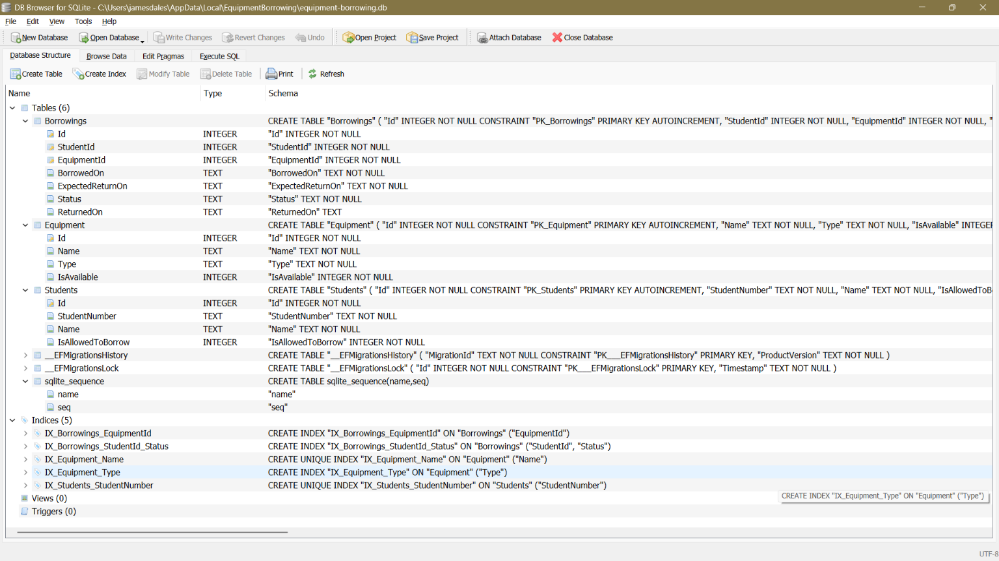
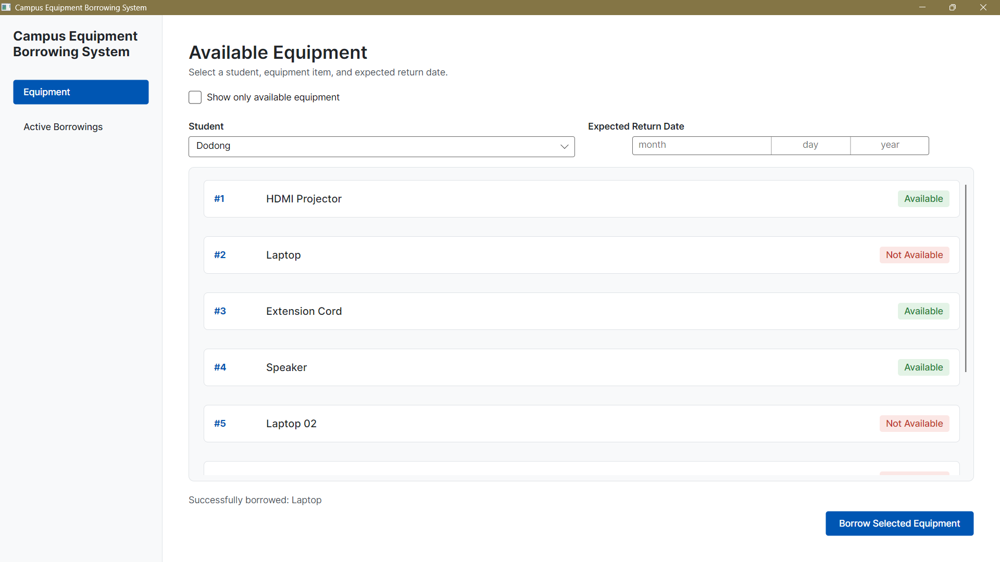
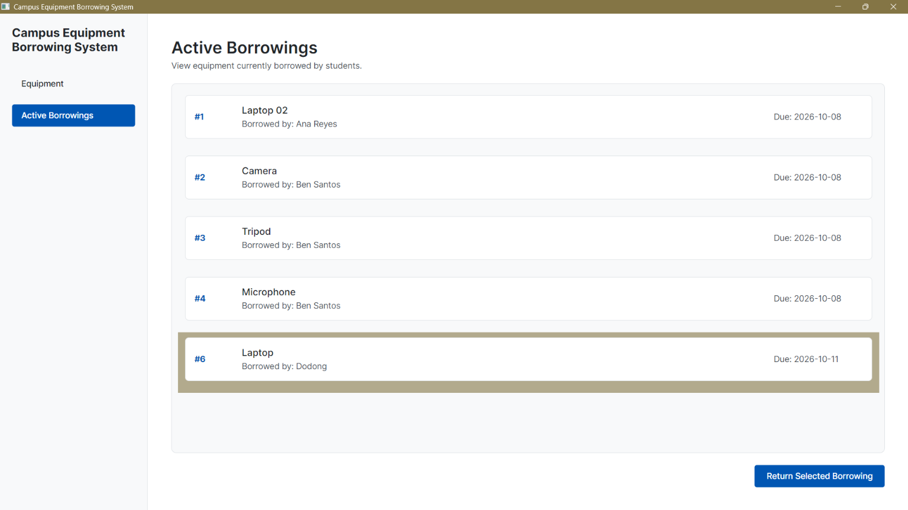
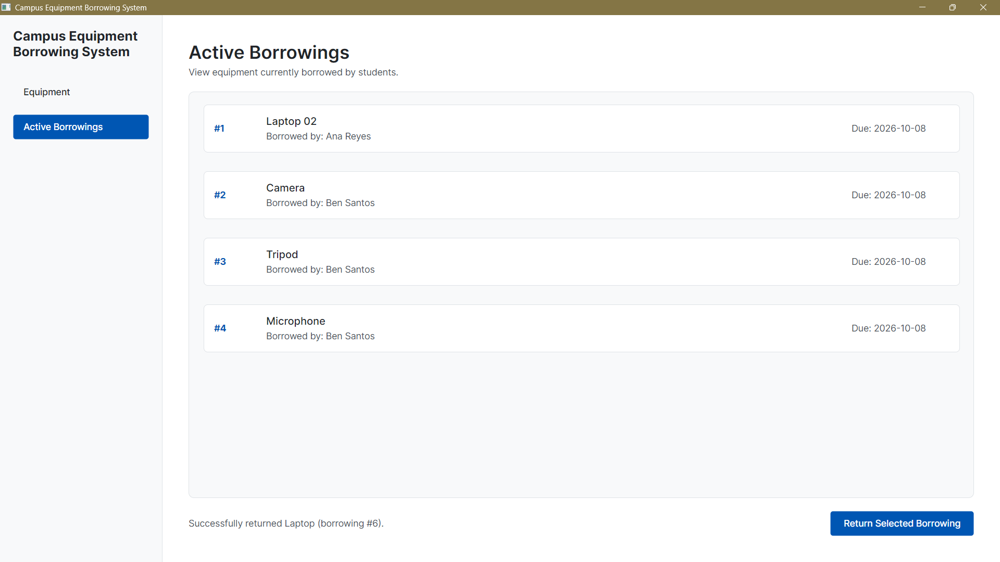
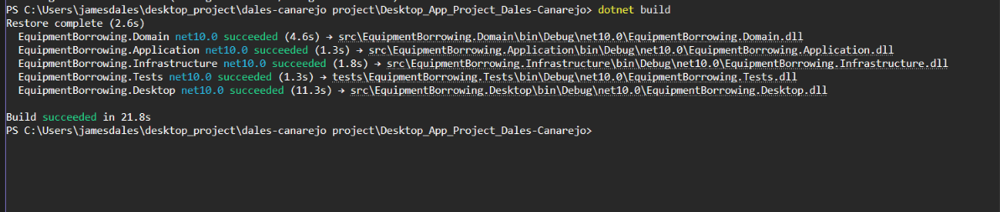

# Campus Equipment Borrowing System

## 1. Solution Structure

* **Domain**: Holds your core models (`Student`, `Equipment`, `Borrowing`). No logic outside of basic object properties.
* **Application**: Holds the rules and workflow (`BorrowEquipmentService`) and defines repository interfaces.
* **Infrastructure**: Holds actual data storage logic (currently `InMemory` repositories).
* **Tests**: The runnable entry point that acts as a demo to execute test cases.

---

## 2. Dependency Direction

```text
EquipmentBorrowing.Tests
      │
      ├───► EquipmentBorrowing.Infrastructure
      │             │
      │             ▼ (implements interfaces)
      ▼             │
EquipmentBorrowing.Application
      │
      ▼
EquipmentBorrowing.Domain
```

**3. Use Case Mapping**

```text
Actor:                               Student
Use Case:                            Borrow Equipment
Application Service:                 BorrowingServices.cs
Domain Objects Used:                 Student, Equipment, Borrowing, BorrowingStatus
Repository Interfaces Used:          IEquipmentRepository.cs, Exceptions.cs
Infrastructure Implementations Used: EquipmentRepository.cs
```

**4. Reflection**

1. Why depend on repository interfaces instead of databases directly?
- Because it keeps code flexible and can test easily in-memory and swap databases without changing application rules.
2. Which parts remain unchanged if SQLite is added?
- Domain and Application would remain unchanged because they only depend on abstract rules and repository interfaces rather than actual database details.
3. Which project would contain Avalonia Views?
- It would be for new UI projects.
4. Should an Avalonia button execute DB queries directly?
- No, because it should call the Application Service so rules like availability or borrowing limits are properly checked first before executing DB queries directly.
5. What part represents the actual business operation?
- The BorrowingServices.cs method because it coordinates all the steps and imposed the borrowing rules requested by the actor. It also ensures the student is allowed to borrow, checks item availability, and updates system records all in one place before completing the request.

---

# ACT#2 – Desktop Application and Updated Architecture

## 6. Desktop Project

The project now has an **Avalonia Desktop project** called `EquipmentBorrowing.Desktop`.

This project contains the main user interface of the system. It has two main pages:

* **Available Equipment** – where the user can select a student, equipment, and return date before borrowing.
* **Active Borrowings** – where the user can see active borrowings and return an equipment.

The Desktop project also uses **MVVM** through CommunityToolkit.Mvvm. The Views handle the UI, while the ViewModels handle the user actions, selected items, messages, and calls to the Application layer.

---

## 7. Updated Architecture

The updated flow of the system is:

```text
View
  ↓
ViewModel
  ↓
Application Service
  ↓
Repository Interface
  ↓
Infrastructure
```

Each part has its own job:

* **Domain** – contains the main objects like `Student`, `Equipment`, and `Borrowing`.
* **Application** – contains the main operations and rules, such as borrowing and returning equipment.
* **Infrastructure** – handles the actual data storage. Currently, it uses in-memory repositories.
* **Desktop** – contains the Avalonia UI, ViewModels, navigation, and dependency injection setup.
* **Tests** – used to test and demonstrate that the system works.

The View does not directly access the repositories. Instead, the ViewModel connects the UI to the Application Service, which then handles the actual operation.

---

## 8. Borrow Equipment Flow

The borrowing process works like this:

```text
User selects student, equipment, and return date
                    ↓
             Equipment View
                    ↓
          Equipment ViewModel
                    ↓
        BorrowEquipmentService
                    ↓
          Repository Interfaces
                    ↓
         In-Memory Repositories
                    ↓
       Equipment becomes unavailable
       and borrowing is recorded
```

First, the user selects a student, an available equipment, and an expected return date.

When the user clicks **Borrow Selected Equipment**, the `EquipmentViewModel` sends the request to `BorrowEquipmentService`.

The service then checks the important rules, such as:

* Does the student exist?
* Is the student allowed to borrow?
* Is the equipment available?
* Has the student reached the borrowing limit?
* Is the return date valid?

If everything is okay, the equipment is marked as unavailable and a new borrowing is added.

The ViewModel then refreshes the equipment list and shows a success message.

---

## 9. Return Equipment Flow

The return process works like this:

```text
User selects an active borrowing
                    ↓
            Borrowings View
                    ↓
         Borrowings ViewModel
                    ↓
        ReturnEquipmentService
                    ↓
          Repository Interfaces
                    ↓
         In-Memory Repositories
                    ↓
      Borrowing becomes returned
      and equipment becomes available
```

The user first selects an active borrowing from the list.

After clicking **Return Selected Borrowing**, the `BorrowingsViewModel` calls the `ReturnEquipmentService`.

The service checks if the borrowing exists and if it has not already been returned.

If everything is okay, the borrowing is marked as returned and the equipment becomes available again.

The ViewModel then reloads the active borrowings list so the returned item is removed from the list.

---

## 10. Architectural Reflection

### 1. Why should the View not call the repository directly?

The View should mainly handle the UI. If it directly calls the repository, it could skip some of the rules in the Application layer. Using the Application Service keeps the process organized.

### 2. Why should business rules not be placed in the ViewModel?

The ViewModel is mainly for handling the UI and user actions. Things like checking equipment availability or the borrowing limit should be handled by the Application Service instead.

### 3. What is the responsibility of the ViewModel?

The ViewModel connects the UI to the Application layer. It handles things like selected items, buttons, lists, messages, and calling the correct service.

### 4. Why can the Application layer work without knowing about Avalonia?

The Application layer does not use Avalonia. It only works with the Domain and repository interfaces. Because of this, the same Application code could still be used even if the UI was changed to something else.

### 5. What is the advantage of having one DI composition point?

The Desktop project has one main place where all the dependencies are registered. This makes it easier to see which repositories, services, and ViewModels are being used.

The repositories are also registered as singletons, so the same in-memory data is shared throughout the application. This is why an equipment that was borrowed becomes unavailable and stays that way when moving between pages.

### 6. Which interface parts stay unchanged if SQLite replaces the in-memory repository?

The repository interfaces can mostly stay the same. The main change would be in the Infrastructure project, where the in-memory repositories would be replaced with SQLite repositories.

The Application Services would still use the same interfaces, so the borrowing and returning logic would not need to be rewritten just because the storage changed.


          


---

# ACT#3 – SQLite Persistence with Entity Framework Core

> Sections 1–10 above describe Laboratory Activities 1 and 2 and are kept as written.
> Where they say the storage is "in-memory", that was true at the time. The application now
> stores its data in SQLite through Entity Framework Core, as described below.

## 11. Relational Database Design


The design comes from the existing domain models. Full details are in
[`docs/database-design.md`](docs/database-design.md) and the SQL demonstration is in
[`docs/database-queries.sql`](docs/database-queries.sql).

| Table | Key columns | Notes |
|---|---|---|
| `Students` | `Id` (PK), `StudentNumber` (unique), `Name`, `IsAllowedToBorrow` | One row per student |
| `Equipment` | `Id` (PK), `Name` (unique), `Type` (indexed), `IsAvailable` | One row per physical item |
| `Borrowings` | `Id` (PK), `StudentId` (FK), `EquipmentId` (FK), `BorrowedOn`, `ExpectedReturnOn`, `Status`, `ReturnedOn` (optional) | One row per borrowing |

**Relationships**

* One `Student` has many `Borrowings` (`Borrowings.StudentId` → `Students.Id`).
* One `Equipment` item has many `Borrowings` over time (`Borrowings.EquipmentId` → `Equipment.Id`).
* A borrowing belongs to exactly one student and one equipment item. It stores only their ids,
  never a copy of their details.

**Important constraints**

* Unique: `Students.StudentNumber`, `Equipment.Name`.
* Foreign keys use `Restrict`, so a student or equipment with borrowing history cannot be deleted.
* `CHECK (ExpectedReturnOn > BorrowedOn)`.
* `CHECK` that `Status` and `ReturnedOn` agree: `Active` has no return date, `Returned` always has one.
* Indexes on `Borrowings(StudentId, Status)`, `Borrowings(EquipmentId)` and `Equipment(Type)`.
* `ReturnedOn` is the only optional column. `Status` is the `BorrowingStatus` enum stored as text.

Two properties were added to the domain for this activity: `Student.StudentNumber` and `Equipment.Type`.

---

## 12. SQLite and EF Core

Two packages were added to **`EquipmentBorrowing.Infrastructure` only**:

```text
Microsoft.EntityFrameworkCore.Sqlite   (the SQLite provider)
Microsoft.EntityFrameworkCore.Design   (design-time tooling used by the migrations)
```

plus the command-line tool, installed once per computer:

```powershell
dotnet tool install --global dotnet-ef
```

The Domain, Application and Desktop projects have no reference to EF Core or SQLite.

The database file is `equipment-borrowing.db`, stored in the user's local application data
folder (`%LOCALAPPDATA%\EquipmentBorrowing\`). `DatabaseLocation` is the one place that decides
this path, so the running application and the `dotnet ef` tools always use the same file, and
the data survives rebuilds.

The Desktop project connects everything with two calls in `App.axaml.cs`:

```csharp
services.AddPersistence();                       // registers EF Core and the repositories
await serviceProvider.InitializeDatabaseAsync(); // applies pending migrations at startup
```

`AddPersistence()` uses `AddDbContextFactory` instead of a single shared `DbContext`. The
ViewModels live for the whole session, and a `DbContext` that lives that long would keep stale
tracked data, so every repository method creates a short-lived context and disposes it. The
repositories are registered as singletons because they hold no state of their own.
`InitializeDatabaseAsync()` calls `Database.MigrateAsync()`, which creates the database if it is
missing, applies only the migrations not yet applied, and never deletes existing data.

---

## 13. DbContext

`EquipmentBorrowingDbContext` (in `Infrastructure/Persistence`) is the application's gateway to
SQLite. Its responsibilities are:

* declaring the tables the application uses (`Students`, `Equipment`, `Borrowings` as `DbSet`s);
* loading the entity mapping rules (`StudentConfiguration`, `EquipmentConfiguration`,
  `BorrowingConfiguration`) through `ApplyConfigurationsFromAssembly`;
* tracking the changes made to loaded entities and writing them to the database when
  `SaveChangesAsync` is called.

It is used only inside the Infrastructure layer. The mapping rules live in the configuration
classes, so the Domain classes contain no persistence attributes.

---

## 14. Repository Transition

Before (Laboratory Activity 2):

```text
Repository Interface
  ↓
In-Memory Repository (Dictionary<int, T>)
```

Now:

```text
Repository Interface
  ↓
EF Core Repository (EfStudentRepository / EfEquipmentRepository / EfBorrowingRepository)
  ↓
EquipmentBorrowingDbContext
  ↓
SQLite
```

The application services (`BorrowEquipmentService`, `ReturnEquipmentService`) still depend only on
the repository interfaces. Their borrowing and returning rules did not change. A few small
changes were needed, all of them behind the interfaces:

| Change | Why |
|---|---|
| `IStudentRepository.GetAllAsync` | The student dropdown was hard-coded to student 1 |
| `IEquipmentRepository.GetAvailableAsync` | The database filters available equipment (LINQ query 1) |
| `IBorrowingRepository.SaveAsync` | A database must be told to save a changed borrowing |
| `IBorrowingRepository.GetActiveWithDetailsAsync` | One joined query for the Active Borrowings page (LINQ query 2) |
| `ReturnEquipmentService` now calls `_borrowings.SaveAsync` | With in-memory storage the borrowing object was shared, so the change was never saved explicitly. With a database it would have stayed `Active` forever. |

The in-memory repositories are kept (and updated to implement the new interface members) because
the `EquipmentBorrowing.Tests` demonstration still runs against them. The desktop application no
longer uses them.

---

## 15. Migration Process

Run from `src/EquipmentBorrowing.Infrastructure`:

```powershell
# create the migration (generates the files in Infrastructure/Migrations)
dotnet ef migrations add InitialCreate

# apply it (creates equipment-borrowing.db with the tables and the seed data)
dotnet ef database update
```

`InitialCreate` created `Students`, `Equipment`, `Borrowings` and `__EFMigrationsHistory`, and
inserted the seed data. The generated files are committed in `Infrastructure/Migrations`, so the
database can be rebuilt from the repository. The seed data (4 students, 8 equipment items,
5 borrowings, including one student at the borrowing limit and one not allowed to borrow) is part
of the migration, so it is inserted once and is not re-applied on later starts.

---

## 16. Generated SQL

The SQL below was captured from the Visual Studio Output window while the application ran
(EF Core command logging is switched on in Debug builds). More queries and the tracking evidence
are in [`docs/generated-sql.md`](docs/generated-sql.md).

### Active borrowings with student and equipment (LINQ query 2)

**LINQ**

```csharp
from b in context.Borrowings
join s in context.Students on b.StudentId equals s.Id
join e in context.Equipment on b.EquipmentId equals e.Id
where b.Status == BorrowingStatus.Active
orderby b.ExpectedReturnOn, b.Id
select new ActiveBorrowingDetails(b.Id, s.Name, e.Name, b.BorrowedOn, b.ExpectedReturnOn);
```

**Generated SQL**

```sql
SELECT "b"."Id", "s"."Name", "e"."Name", "b"."BorrowedOn", "b"."ExpectedReturnOn"
FROM "Borrowings" AS "b"
INNER JOIN "Students" AS "s" ON "b"."StudentId" = "s"."Id"
INNER JOIN "Equipment" AS "e" ON "b"."EquipmentId" = "e"."Id"
WHERE "b"."Status" = 'Active'
ORDER BY "b"."ExpectedReturnOn", "b"."Id"
```

**Explanation:** a borrowing stores only `StudentId` and `EquipmentId`, so the two LINQ `join`s
became two SQL `INNER JOIN`s that follow the foreign keys. The three tables are combined in a
single round trip. The enum value `BorrowingStatus.Active` became the text `'Active'` because of
the enum-to-string conversion in the entity configuration, and the `select new` projection makes
EF fetch only the five columns the page shows.

### Active borrowing count for a student (LINQ query 3)

**LINQ**

```csharp
context.Borrowings.CountAsync(
    b => b.StudentId == studentId && b.Status == BorrowingStatus.Active);
```

**Generated SQL**

```sql
SELECT COUNT(*)
FROM "Borrowings" AS "b"
WHERE "b"."StudentId" = @studentId AND "b"."Status" = 'Active'
```

**Explanation:** the database counts the rows and returns one number, so no borrowings are loaded
into memory. The student id is sent as a parameter (`@studentId`), not pasted into the SQL text.
`BorrowEquipmentService` uses this count to enforce the limit of 3 active borrowings.

(Query 1, available equipment, is `WHERE "e"."IsAvailable"`; see `docs/generated-sql.md`.)

### Tracking and no-tracking

* **Display-only reads** (equipment list, available-only list, student dropdown, active borrowings)
  use `AsNoTracking()`. Nothing is saved from those objects, so EF does not need to remember them.
* **Writes** (`EfEquipmentRepository.SaveAsync`, `EfBorrowingRepository.SaveAsync`) load the stored
  row **with tracking**, copy the new values onto it, and let EF detect what changed. The log shows
  that only the changed columns are updated, for example
  `UPDATE "Borrowings" SET "ReturnedOn" = @p0, "Status" = @p1 WHERE "Id" = @p2`.

---

## 17. Persistence Demonstration

The pair verified persistence with this procedure:

1. Start the application (Visual Studio, startup project `EquipmentBorrowing.Desktop`).
2. Borrow an available item as a student. The success message appears and the item becomes
   *Not Available*.
3. Open **Active Borrowings**. The new borrowing is listed (with the student and equipment names).
4. **Close the application completely.**
5. Start it again. The borrowing is still listed and the item is still *Not Available*.
6. Return the borrowing. The success message appears and the row disappears.
7. Close the application, start it again. The borrowing is still gone and the item is *Available*.

The SQL log confirms what is written each time: a borrow runs
`UPDATE "Equipment" SET "IsAvailable"` and `INSERT INTO "Borrowings"`; a return runs
`UPDATE "Equipment" SET "IsAvailable"` and `UPDATE "Borrowings" SET "ReturnedOn", "Status"`.
The failure cases also still work and show their messages (a student who is not allowed to
borrow, an item that is not available).

| Evidence | Screenshot |
|---|---|
| Tables in an SQLite viewer | `docs/screenshots/01-tables-in-viewer.png` |
| Stored Students, Equipment and Borrowings data | `docs/screenshots/02-stored-data.png` |
| Successful borrow | `docs/screenshots/03-borrow-success.png` |
| Borrowing still there after restart | `docs/screenshots/04-after-restart.png` |
| Successful return | `docs/screenshots/05-return-success.png` |
| Successful `dotnet build` | `docs/screenshots/06-build-success.png` |








---

## 18. Architectural Reflection (Laboratory Activity 3)

**Tracing a Borrow click through the layers**

```text
User presses "Borrow Selected Equipment"          EquipmentView.axaml (button bound to a command)
  ↓
BorrowSelectedEquipmentCommand                    EquipmentViewModel: checks the selections, calls the service
  ↓
BorrowEquipmentService.BorrowAsync                Application: student exists/allowed, equipment available,
  ↓                                               limit of 3, valid return date
IStudentRepository / IEquipmentRepository /       Application: interfaces only, no EF Core
IBorrowingRepository
  ↓
EfStudentRepository / EfEquipmentRepository /     Infrastructure: LINQ queries, AsNoTracking vs tracking,
EfBorrowingRepository                             creates a short-lived DbContext per call
  ↓
EquipmentBorrowingDbContext                       Infrastructure: mapping, change tracking, SaveChangesAsync
  ↓
SQLite (equipment-borrowing.db)                   UPDATE Equipment, INSERT Borrowings → persistent record
```

### 1. Why did the application not need to be completely rewritten when SQLite was introduced?

The Views, ViewModels and Application services depend on the repository interfaces, never on a
storage technology. So the work was concentrated in the Infrastructure project (DbContext,
mappings, migration, EF repositories) and in one place in the Desktop project, the dependency
registration. The interfaces only gained a few methods, and the services kept their rules.

### 2. Why should the ViewModel not use DbContext directly?

A ViewModel handles user interface state and commands. If it used the `DbContext`, it would mix
UI with persistence, could skip the business rules in the Application layer (availability, the
borrowing limit), and would be tied to EF Core and SQLite. It would also be hard to test, and
a long-lived ViewModel would hold a `DbContext` that is meant to be short-lived.

### 3. What responsibility does the repository implementation now perform?

It translates domain-level requests ("get the available equipment", "save this borrowing") into
EF Core operations: writing the LINQ queries, deciding between tracking and no-tracking, creating
and disposing the `DbContext`, and calling `SaveChangesAsync`. It does not contain business rules.

### 4. What is the purpose of an EF Core migration?

A migration is a versioned, repeatable description of a database schema change, generated from
the model. It lets anyone rebuild the same database from the repository, records which changes
have been applied (`__EFMigrationsHistory`), and lets the schema evolve later without recreating
the database by hand.

### 5. Why are foreign keys important in the borrowing database?

They guarantee that every borrowing refers to a student and an equipment item that really exist,
so there are no orphan borrowing records. With `Restrict`, they also stop a student or equipment
with borrowing history from being deleted. They are also what the joins in the queries follow.

### 6. Why can a read-only query benefit from AsNoTracking()?

By default EF Core remembers every loaded entity so it can detect changes later. For lists that
are only displayed, that bookkeeping is wasted memory and time. `AsNoTracking()` skips it, and it
also states that the data is not meant to be saved.

### 7. What would happen to the rest of the application if the SQLite implementation were replaced later by another database provider?

The Domain, Application, ViewModels and Views would not change, because they only know the
repository interfaces. The change would be in Infrastructure: switch the provider package and the
`UseSqlite` call (for example to PostgreSQL), and regenerate the migrations for the new provider.
Some details are provider-specific and would need review, such as the raw SQL in the `CHECK`
constraints and how dates and booleans are stored.
