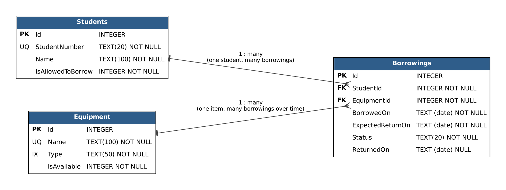

# Relational Database Design

This document answers Laboratory Activity 3, Parts A and B. The design comes from
the domain models built in Laboratory Activity 1, not the other way around.

## Part A: Review of the existing data model

| Question | Student | Equipment | Borrowing |
|---|---|---|---|
| Unique identifier | `Id` (also `StudentNumber`, see below) | `Id` (also `Name`) | `Id` |
| Required | `StudentNumber`, `Name`, `IsAllowedToBorrow` | `Name`, `Type`, `IsAvailable` | everything except `ReturnedOn` |
| Optional | none | none | `ReturnedOn` (empty until returned) |
| Relationships | has many Borrowings | has many Borrowings | belongs to one Student and one Equipment |
| Constrained values | `StudentNumber` unique | `Name` unique, `Type` limited length | `Status` is `Active` or `Returned`; due date after borrow date |
| Avoid duplicating | n/a | n/a | stores `StudentId` / `EquipmentId`, never the student's or equipment's details |

Two properties in the code needed a decision:

- `Equipment.AvailabilityStatus` is computed from `IsAvailable` for display, so it is
  **not stored** (one fact, one place).
- `Borrowing.Status` is an enum. It is stored as text (`'Active'`, `'Returned'`) so the
  SQL is readable.

Two small properties were added to the domain so the design has a real unique
constraint and a real filter/grouping column: `Student.StudentNumber` and
`Equipment.Type`.

## Part B: Tables

### Students
| Column | Type | Rules |
|---|---|---|
| Id | INTEGER | **Primary key**, auto-generated |
| StudentNumber | TEXT(20) | Required, **unique** |
| Name | TEXT(100) | Required |
| IsAllowedToBorrow | INTEGER (0/1) | Required |

### Equipment
| Column | Type | Rules |
|---|---|---|
| Id | INTEGER | **Primary key**, auto-generated |
| Name | TEXT(100) | Required, **unique** (each physical item has its own label) |
| Type | TEXT(50) | Required, indexed |
| IsAvailable | INTEGER (0/1) | Required |

### Borrowings
| Column | Type | Rules |
|---|---|---|
| Id | INTEGER | **Primary key**, auto-generated |
| StudentId | INTEGER | Required, **foreign key** to Students(Id) |
| EquipmentId | INTEGER | Required, **foreign key** to Equipment(Id) |
| BorrowedOn | TEXT (date) | Required |
| ExpectedReturnOn | TEXT (date) | Required |
| Status | TEXT(20) | Required, `Active` or `Returned` |
| ReturnedOn | TEXT (date) | **Optional** (NULL while active) |

## Relationships

- One Student has many Borrowings (`Borrowings.StudentId` -> `Students.Id`).
- One Equipment has many Borrowings over time (`Borrowings.EquipmentId` -> `Equipment.Id`).
- Each Borrowing belongs to exactly one Student and exactly one Equipment.
- Delete behaviour is **Restrict**: a student or equipment that has borrowing history
  cannot be deleted, which protects the history.

## Constraints and indexes

| Item | Purpose |
|---|---|
| `UNIQUE (Students.StudentNumber)` | No two students share a school number |
| `UNIQUE (Equipment.Name)` | Every physical item is distinguishable |
| `CHECK (ExpectedReturnOn > BorrowedOn)` | Matches the application rule that the due date is after the borrow date |
| `CHECK (Active AND ReturnedOn IS NULL, or Returned AND ReturnedOn IS NOT NULL)` | Status and return date can never disagree |
| `INDEX Borrowings (StudentId, Status)` | Speeds up "count active borrowings for a student", run on every borrow |
| `INDEX Borrowings (EquipmentId)` | Speeds up borrowing history of one item (and foreign key lookups) |
| `INDEX Equipment (Type)` | Speeds up filtering and grouping by type |

The business rules (borrowing limit, availability) stay in the Application layer.
The database constraints are a safety net underneath them, not a replacement.

## Seed data

Inserted once by the `InitialCreate` migration: 4 students (one not allowed to borrow),
8 equipment items (4 available, 4 borrowed), 5 borrowings (4 active, 1 returned).
Ben Santos holds 3 active borrowings, so he is at the limit and demonstrates the
"limit exceeded" error. See `SeedData.cs`.
